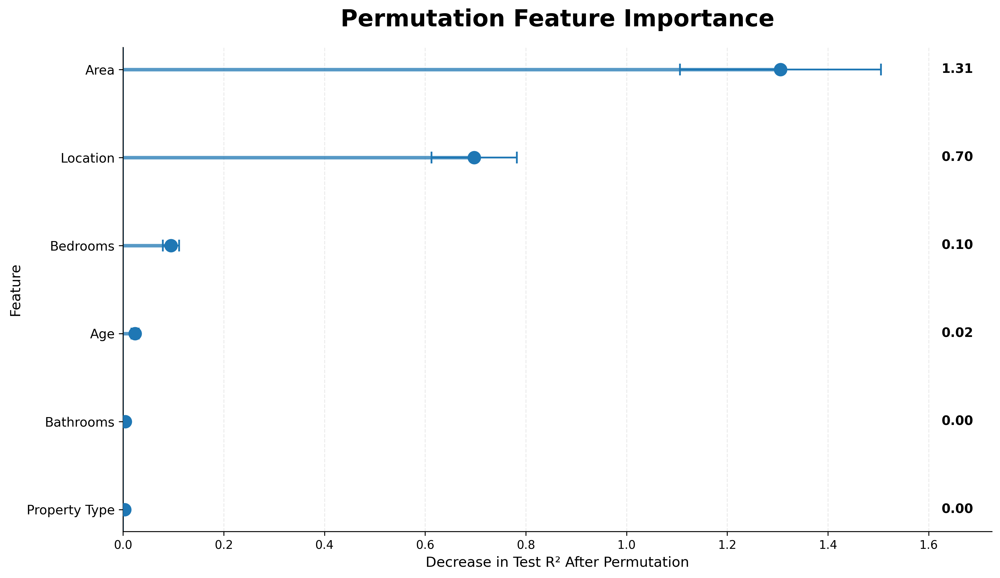

# 🏠 House Price Prediction — Advanced Machine Learning Project

> **End-to-end house-price prediction using Regression, Ensemble Learning, Hyperparameter Optimization, Feature Importance, and Model Diagnostics**


---

## 📌 Project Overview

This project develops a complete, reproducible, and interpretable machine-learning workflow for predicting residential property prices.

The project goes beyond a basic regression implementation by combining:

- Data loading and validation
- Data quality checks
- Exploratory Data Analysis (EDA)
- Correlation and relationship analysis
- Feature preparation and categorical encoding
- Leakage-safe preprocessing
- Train-test splitting
- Linear Regression implemented from scratch
- Validation against Scikit-learn Linear Regression
- Polynomial Regression
- Decision Tree Regression
- Random Forest Regression
- Random Forest hyperparameter optimization using 5-fold cross-validation
- Permutation Feature Importance
- Actual vs. Predicted analysis
- Residual diagnostics
- Model comparison
- Business interpretation
- Limitations and future scope

The objective is not only to obtain a strong prediction score, but also to demonstrate a **complete, reproducible, and interpretable machine-learning workflow**.

---

## 🎯 Objectives

The major objectives of this project are:

1. Understand the structure and quality of the house-price dataset.
2. Explore relationships between property characteristics and price.
3. Identify the most influential variables associated with house prices.
4. Prepare numerical and categorical variables for machine learning.
5. Implement Multiple Linear Regression mathematically from scratch.
6. Validate the custom implementation against Scikit-learn.
7. Compare linear and nonlinear regression approaches.
8. Optimize Random Forest hyperparameters using cross-validation.
9. Evaluate models using MAE, MSE, RMSE, and R².
10. Diagnose the final model using residual analysis.
11. Select the best-performing model based on unseen test data.
12. Translate statistical and machine-learning findings into practical insights.

---

## 📊 Dataset

The project uses a residential property dataset containing **300 observations**.

### Features

#### Numerical Predictors

- `Area`
- `Bedrooms`
- `Bathrooms`
- `Age`

#### Categorical Predictors

- `Location`
- `Property_Type`

#### Identifier

- `Property_ID`

`Property_ID` is treated as an identifier and is excluded from predictive modelling.

### Target Variable

**Price**

The objective of the machine-learning models is to learn the relationship between property characteristics and selling price.

---

## 🧰 Technology Stack

| Category | Technology |
|---|---|
| Programming Language | Python |
| Data Manipulation | Pandas |
| Numerical Computing | NumPy |
| Visualization | Matplotlib, Seaborn |
| Machine Learning | Scikit-learn |
| Development Environment | Jupyter Notebook / VS Code |
| Output Format | CSV, PNG |
| Documentation | Markdown |

---

## 🔄 Project Workflow

The complete workflow follows this sequence:

**Dataset**  
↓  
**Data Loading & Validation**  
↓  
**Data Cleaning / Quality Checks**  
↓  
**Exploratory Data Analysis**  
↓  
**Feature Selection**  
↓  
**Train-Test Split**  
↓  
**Leakage-Safe Preprocessing**  
↓  
**Linear Regression From Scratch**  
↓  
**Scikit-learn Validation**  
↓  
**Polynomial Regression**  
↓  
**Decision Tree Regression**  
↓  
**Random Forest Regression**  
↓  
**Hyperparameter Optimization**  
↓  
**Final Model Evaluation**  
↓  
**Feature Importance**  
↓  
**Residual Diagnostics**  
↓  
**Model Comparison**  
↓  
**Business Insights & Conclusion**

---

# 🔎 Exploratory Data Analysis

The EDA phase investigates the distribution of house prices and the relationships between property characteristics and price.

## 1. Price Distribution

The price distribution provides an initial understanding of the target variable and the range of property prices represented in the dataset.


---

## 2. Area vs Price

Area shows a strong positive relationship with price. Larger properties generally tend to have higher prices in this dataset.


---

## 3. Bedrooms & Bathrooms vs Price

Bedrooms and bathrooms were examined to understand whether property facilities are associated with higher house prices.


---

## 4. Location & Property Type

The distribution of properties across location and property type categories was examined to understand the categorical structure of the dataset.


---

## 5. Age vs Price

The relationship between property age and price was analysed to determine whether older properties tend to have different price levels.


---

## 6. Correlation Heatmap

The correlation matrix was used to examine linear relationships among numerical variables.


---

## 7. Area-Price Relationship by Location

The Area-Price relationship was further examined within individual location categories.


---

# 🧹 Data Preprocessing

The preprocessing workflow was designed to prevent data leakage and maintain consistency between training and testing data.

### Steps Performed

- Separated predictors and target variable.
- Removed identifier information from the feature set.
- Split the dataset into training and testing subsets.
- Used **80% training data = 240 observations**.
- Used **20% testing data = 60 observations**.
- Identified numerical and categorical features.
- Applied one-hot encoding to categorical variables.
- Used `drop="first"` to avoid the dummy-variable trap.
- Fitted preprocessing transformations using training data only.
- Applied the learned transformations to the test data.

### Reference Categories

The categorical encoding uses reference categories:

- **City Center** → reference category for `Location`
- **Apartment** → reference category for `Property_Type`

### Encoded Categorical Features

The resulting encoded categorical features include:

- `Location_Rural`
- `Location_Suburb`
- `Property_Type_House`
- `Property_Type_Villa`

Together with:

- `Area`
- `Bedrooms`
- `Bathrooms`
- `Age`

This produces **8 model features after preprocessing**.

The preprocessing summary is available in:

`results/preprocessing_summary.csv`

---

# 🤖 Machine Learning Models

Multiple regression approaches were developed and evaluated using the same processed data and unseen test set.

---

## 1. Linear Regression — From Scratch

Multiple Linear Regression was implemented manually using the Ordinary Least Squares approach.

The implementation uses the design matrix to estimate regression coefficients without relying on Scikit-learn's Linear Regression implementation.

The solution was additionally checked using the Moore-Penrose pseudoinverse for numerical stability.

### Validation

The custom implementation was compared against Scikit-learn Linear Regression using:

- MAE
- MSE
- RMSE
- R²

The two implementations produced effectively identical predictions, validating the mathematical implementation.

Results are stored in:

`results/linear_regression_scratch_results.csv`

`results/scratch_vs_sklearn_comparison.csv`

---

## 2. Linear Regression — Scikit-learn

Scikit-learn's `LinearRegression` was trained using the same processed training data and evaluated on the same unseen test set.

This model serves as an interpretable baseline against which the nonlinear and ensemble models are compared.

---

## 3. Polynomial Regression

A **degree-2 Polynomial Regression** model was used to investigate whether nonlinear relationships could improve prediction performance.

Only numerical predictors were polynomial-expanded, while categorical variables remained one-hot encoded.

### Configuration

- Polynomial Degree: **2**
- Polynomial Features: `Area`, `Bedrooms`, `Bathrooms`, `Age`
- Categorical Features: `Location`, `Property_Type`

The degree-2 model did not outperform Linear Regression on this dataset.

Results are stored in:

`results/polynomial_regression_results.csv`

---

## 4. Decision Tree Regression

A controlled Decision Tree Regression model was developed to capture nonlinear relationships and feature interactions.

### Initial Configuration

| Parameter | Value |
|---|---:|
| Maximum Depth | 6 |
| Minimum Samples Split | 10 |
| Minimum Samples Leaf | 5 |
| Random State | 42 |

### Test Performance

| Metric | Score |
|---|---:|
| MAE | ₹2,588,829.20 |
| MSE | ₹10,846,294,140,743.33 |
| RMSE | ₹3,293,371.24 |
| R² | 0.9238 |

The Decision Tree performed below the Linear Regression baseline on the held-out test set.

Results are stored in:

`results/decision_tree_results.csv`

---

## 5. Random Forest Regression

Random Forest Regression was introduced to capture nonlinear relationships and feature interactions while reducing the limitations of a single Decision Tree.

Random Forest combines predictions from multiple decision trees to produce a more robust ensemble prediction.

### Initial Configuration

| Parameter | Value |
|---|---:|
| Number of Trees | 300 |
| Maximum Depth | 8 |
| Minimum Samples Split | 5 |
| Minimum Samples Leaf | 2 |
| Max Features | `sqrt` |
| Random State | 42 |

### Initial Model Performance

| Metric | Score |
|---|---:|
| MAE | ₹3,684,313.62 |
| MSE | ₹23,182,820,406,988.07 |
| RMSE | ₹4,814,854.14 |
| R² | 0.8372 |

The initial Random Forest performed considerably below the other strong baseline models. This demonstrated that ensemble models do not automatically outperform simpler approaches and that appropriate hyperparameter configuration is important.

Results are stored in:

`results/random_forest_results.csv`

---

# ⚙️ Random Forest Hyperparameter Optimization

The initial Random Forest showed significant room for improvement.

A systematic hyperparameter optimization process was therefore performed using **Randomized Search with 5-fold Cross-Validation**.

## Optimization Strategy

The search considered:

- Number of estimators
- Maximum tree depth
- Minimum samples required for a split
- Minimum samples required at a leaf
- Number of features considered at each split

### Cross-Validation Setup

| Parameter | Value |
|---|---:|
| Search Method | Randomized Search |
| Candidate Configurations | 20 |
| Cross-Validation | 5-Fold |
| Total Model Fits | 100 |
| Optimization Metric | RMSE |
| Random State | 42 |

The **test dataset remained completely isolated during hyperparameter optimization**.

### Best Hyperparameter Configuration

| Hyperparameter | Optimal Value |
|---|---:|
| Number of Trees (`n_estimators`) | **300** |
| Maximum Depth (`max_depth`) | **12** |
| Minimum Samples Split (`min_samples_split`) | **2** |
| Minimum Samples Leaf (`min_samples_leaf`) | **2** |
| Max Features (`max_features`) | **1.0** |
| Random State | **42** |

### Best Cross-Validated RMSE

**₹2,188,687.95**

The optimized configuration substantially improved the Random Forest model.

Results are stored in:

`results/optimized_random_forest_results.csv`

---

# 🏆 Final Model Performance

After hyperparameter optimization, the **Optimized Random Forest Regression** model was selected as the final predictive model.

The final evaluation was performed on the **unseen 20% test dataset containing 60 observations**.

## Final Test Performance

| Metric | Optimized Random Forest |
|---|---:|
| **MAE** | **₹1,611,259.09** |
| **MSE** | **₹4,923,749,816,934.83** |
| **RMSE** | **₹2,218,952.41** |
| **R²** | **0.9654** |

### R² Interpretation

An R² score of **0.9654** means that approximately **96.54% of the variation in house prices is explained by the model on the held-out test dataset**.

### RMSE Interpretation

The RMSE is approximately **₹2.22 million**, representing the scale of prediction error in the same monetary unit as the target variable.

### MAE Interpretation

The MAE is approximately **₹1.61 million**, representing the average absolute difference between actual and predicted house prices on the test dataset.

### MSE Interpretation

The MSE is approximately **₹4.92 × 10¹²**. Because errors are squared, larger prediction errors receive greater weight.

> **Important:** These metrics describe predictive performance on this dataset and this particular test split. They should not be interpreted as a guarantee of the same performance on another housing market or future dataset.

---

# 📊 Model Performance Comparison

All evaluated models were compared using R² and RMSE on the same unseen test dataset.

## R² Comparison

**Higher R² indicates better performance.**

| Model | R² |
|---|---:|
| **Optimized Random Forest** | **0.9654** |
| Linear Regression | 0.9406 |
| Polynomial Regression | 0.9290 |
| Decision Tree | 0.9238 |
| Initial Random Forest | 0.8372 |


---

## RMSE Comparison

**Lower RMSE indicates better performance.**

| Model | RMSE |
|---|---:|
| **Optimized Random Forest** | **₹2.22M** |
| Linear Regression | ₹2.91M |
| Polynomial Regression | ₹3.18M |
| Decision Tree | ₹3.29M |
| Initial Random Forest | ₹4.81M |


### Comparison Summary

The model comparison shows that:

- Optimized Random Forest achieved the **highest R²**.
- Optimized Random Forest achieved the **lowest RMSE**.
- Linear Regression provided a strong baseline.
- Polynomial Regression did not improve upon Linear Regression.
- Decision Tree Regression performed slightly below Linear Regression.
- Initial Random Forest performed substantially worse before optimization.
- Hyperparameter optimization produced a major improvement in Random Forest performance.

Both R² and RMSE independently identify the **Optimized Random Forest** as the strongest model among the evaluated approaches.

---

# 🎯 Model Diagnostics

Model metrics alone do not provide a complete picture of predictive quality.

The final Optimized Random Forest was therefore evaluated using:

- Actual vs Predicted analysis
- Residual distribution
- Residuals vs Predicted values

---

## Actual vs Predicted Prices


The predictions are generally concentrated around the ideal diagonal relationship between actual and predicted prices.

This indicates strong agreement between observed and predicted values.

A small number of observations show larger deviations from the diagonal, indicating relatively larger prediction errors.

---

## Residual Distribution

A residual is defined as:

**Residual = Actual Price − Predicted Price**


The residuals are generally distributed around zero, indicating that the model does not exhibit a strong overall directional bias.

A small number of observations show relatively large residuals, contributing to the overall RMSE.

---

## Residuals vs Predicted Price


The residuals occur on both sides of zero without a pronounced systematic curve.

This suggests that the final model does not show a strong systematic nonlinear pattern in its remaining prediction errors.

Some increase in error spread can be observed at higher predicted prices, suggesting that expensive properties may be somewhat harder to predict accurately.

### Diagnostic Summary

- Predictions generally follow the actual price pattern closely.
- Residuals are centered approximately around zero.
- No major systematic residual pattern is evident.
- A small number of observations contribute larger prediction errors.
- Higher-priced properties show somewhat greater prediction variability.

---

# 🧠 Model Interpretation

Model evaluation tells us how accurately the model predicts prices, while model interpretation helps explain which variables contribute most to those predictions.

Two complementary approaches were used:

1. Linear Regression coefficient analysis
2. Permutation Feature Importance

---

## Linear Regression Coefficients

The Linear Regression coefficients provide directional information about the relationship between each feature and predicted house price while holding the other variables constant.


The coefficient analysis provides information relative to the selected reference categories.

Categorical coefficients should therefore be interpreted relative to their corresponding reference categories.

Coefficient magnitude should not be treated as a direct feature-importance ranking because the predictors have different units and scales.

The complete coefficient output is available in:

`results/linear_regression_coefficients.csv`

---

## Permutation Feature Importance

Permutation Feature Importance measures how much predictive performance decreases when an individual feature is randomly shuffled.



### Feature Importance Results

| Feature | Importance Mean |
|---|---:|
| **Area** | **1.31** |
| **Location** | **0.70** |
| **Bedrooms** | **0.10** |
| Age | **0.02** |
| Bathrooms | **0.00** |
| Property Type | **0.00** |

### Interpretation

The permutation analysis indicates that:

1. **Area** is the most influential predictive feature.
2. **Location** is the second most influential feature.
3. **Bedrooms** provide additional predictive information.
4. **Age** contributes relatively little compared with Area and Location.
5. **Bathrooms** and **Property Type** show limited standalone permutation importance in this model.

The results reinforce the findings from the exploratory analysis, particularly the strong relationship between Area and Price.

> **Important:** Permutation importance represents predictive contribution, not causation. A feature with high importance should not automatically be interpreted as causing changes in house prices.

Detailed results are available in:

`results/permutation_feature_importance.csv`

---

# 💡 Key Findings & Business Insights

The analysis combines findings from EDA, statistical relationships, model performance, feature importance, and diagnostic evaluation.

## Key Findings

### 1. Area is the strongest numerical predictor

Area has a strong positive relationship with price, with a Pearson correlation of approximately **0.80**.

Larger properties generally command higher prices within this dataset.

### 2. Location has substantial pricing influence

Properties in different locations show meaningful differences in price levels.

Location also ranks highly in permutation importance, demonstrating its predictive value.

### 3. Bedrooms have a moderate relationship with price

Bedrooms show a positive relationship with house price, although their predictive contribution is considerably lower than Area and Location.

### 4. Age has a weak negative relationship with price

Older properties tend to have somewhat lower prices in this dataset.

However, Age is not among the dominant predictive features.

### 5. Bathrooms have limited standalone linear association

Bathrooms show very little linear correlation with price.

This does not necessarily mean bathrooms are irrelevant; their information may overlap with other property characteristics.

### 6. Model complexity does not automatically improve performance

Polynomial Regression and Decision Tree Regression did not outperform Linear Regression.

This demonstrates that greater model complexity alone does not guarantee better generalization.

### 7. Hyperparameter optimization was highly valuable

The initial Random Forest achieved:

**R² = 0.8372**

The optimized Random Forest achieved:

**R² = 0.9654**

This demonstrates the significant impact of appropriate model configuration.

### 8. Optimized Random Forest was the strongest model

The Optimized Random Forest achieved the highest R² and lowest RMSE among the evaluated models.

It was therefore selected as the final predictive model.

---

# 💼 Business Insights

## Property Area

Property area should be considered one of the primary factors when estimating residential property prices because it shows the strongest numerical relationship with price.

## Location

Location should be explicitly considered in valuation models because properties in different locations can have substantially different price levels.

## Property Characteristics

Bedrooms, bathrooms, age, and property type can provide additional information, but their predictive contribution should be evaluated alongside stronger variables rather than in isolation.

## Data-Driven Valuation

Machine-learning models can support property-price estimation by combining multiple characteristics simultaneously.

The Optimized Random Forest provides the strongest predictive performance among the models evaluated in this project.

## Prediction vs Professional Valuation

Model predictions should be treated as analytical estimates rather than exact professional property valuations.

Real-world property prices may also depend on factors that are not included in the dataset.

---

# ⚠️ Limitations

Although the final model achieved strong performance, several limitations should be considered.

## Dataset Size

The dataset contains only **300 observations**.

A relatively small dataset can limit the ability of a model to generalize to a much larger and more diverse housing market.

## Limited Feature Set

The available variables do not capture every factor that can influence property prices.

Potentially important factors such as:

- Distance to schools
- Distance to hospitals
- Public transportation accessibility
- Nearby commercial facilities
- Neighborhood quality
- Parking availability
- Floor number
- Property condition
- Local infrastructure
- Market demand

are not included.

## Geographic Generalization

The dataset may represent a specific housing environment.

Therefore, the model should not automatically be assumed to perform equally well across different cities, regions, or housing markets.

## Temporal Factors

House prices can change over time because of:

- Inflation
- Interest rates
- Economic conditions
- Housing demand
- Government policies
- Local development

These temporal factors are not represented in the current dataset.

## Test Set Size

The final evaluation is based on a held-out test set of **60 observations**.

A larger dataset would allow more robust validation.

## Prediction Errors

The diagnostic analysis shows that some higher-priced properties have relatively larger prediction errors.

The model should therefore be considered a prediction-support tool rather than an exact valuation system.

---

# 🚀 Future Scope

Future versions of the project could include:

### Larger Dataset

Collect a substantially larger dataset covering more properties, locations, and time periods.

### Additional Features

Include:

- Geographic coordinates
- Distance to schools
- Distance to hospitals
- Distance to public transport
- Nearby amenities
- Parking availability
- Floor number
- Property condition
- Furnishing status
- Neighborhood characteristics

### Advanced Machine Learning Models

Evaluate:

- Gradient Boosting
- XGBoost
- LightGBM
- Extra Trees Regression
- Support Vector Regression
- Stacking and ensemble methods

### Advanced Optimization

Compare:

- Grid Search
- Randomized Search
- Bayesian Optimization
- Optuna-based optimization

### More Robust Validation

Use:

- Repeated K-Fold Cross-Validation
- Nested Cross-Validation
- Bootstrap validation
- Multiple train-test splits

### Explainable AI

Extend model interpretation using:

- SHAP
- Partial Dependence Plots
- Individual Conditional Expectation (ICE)
- Advanced permutation-based analysis

### Deployment

Deploy the final model as:

- Streamlit web application
- Flask/FastAPI API
- Desktop application
- Cloud-based prediction service

### Model Monitoring

Monitor:

- Prediction drift
- Data drift
- Feature-distribution changes
- Model accuracy
- Housing-market changes

---

# 📁 Project Structure

The project is organized into separate files and directories for analysis, results, visualizations, and documentation.

```text
HOUSE-PRICE-PREDICTION/
│
├── README.md
├── requirements.txt
├── house_price_prediction.ipynb
├── house_prices.csv
│
├── results/
│   ├── preprocessing_summary.csv
│   ├── numerical_correlation_matrix.csv
│   ├── age_price_correlation.csv
│   ├── area_price_correlation.csv
│   ├── area_price_correlation_by_location.csv
│   ├── bedrooms_bathrooms_price_analysis.csv
│   ├── location_property_type_price_analysis.csv
│   ├── linear_regression_scratch_results.csv
│   ├── scratch_vs_sklearn_comparison.csv
│   ├── linear_regression_coefficients.csv
│   ├── permutation_feature_importance.csv
│   ├── polynomial_regression_results.csv
│   ├── decision_tree_results.csv
│   ├── random_forest_results.csv
│   └── optimized_random_forest_results.csv
│
└── visualizations/
    ├── 01_price_distribution.png
    ├── 02_area_vs_price.png
    ├── 03_bedrooms_bathrooms_vs_price.png
    ├── 04_location_property_type_distribution.png
    ├── 05_age_vs_price.png
    ├── 06_correlation_heatmap.png
    ├── 07_area_price_by_location.png
    ├── actual_vs_predicted.png
    ├── linear_regression_coefficients.png
    ├── model_r2_comparison.png
    ├── model_rmse_comparison.png
    ├── permutation_feature_importance.png
    ├── residual_distribution.png
    └── residuals_vs_predicted.png
```

## Directory Description

| File / Directory | Purpose |
|---|---|
| `house_price_prediction.ipynb` | Complete analysis, modelling, evaluation, and documentation |
| `house_prices.csv` | Original dataset |
| `README.md` | Project documentation |
| `requirements.txt` | Python dependencies |
| `results/` | Machine-readable CSV outputs |
| `visualizations/` | EDA, interpretation, diagnostics, and comparison charts |

---

# 📦 Output Artifacts

## `results/`

The `results/` directory contains machine-readable CSV files generated during the analysis.

These include:

- Preprocessing summaries
- Correlation analysis
- Feature relationship analysis
- Linear Regression results
- Scratch vs Scikit-learn comparison
- Linear Regression coefficients
- Polynomial Regression results
- Decision Tree results
- Random Forest results
- Optimized Random Forest results
- Permutation Feature Importance

## `visualizations/`

The `visualizations/` directory contains PNG files generated during the project.

The visualizations cover:

- Exploratory Data Analysis
- Correlation analysis
- Feature relationships
- Model coefficients
- Feature importance
- Actual vs Predicted analysis
- Residual diagnostics
- R² comparison
- RMSE comparison

---

# ▶️ Installation & Setup

## Clone the Repository

```bash
git clone <YOUR-GITHUB-REPOSITORY-URL>
cd House-Price-Prediction
```

## Create a Virtual Environment

### Windows

```bash
python -m venv venv
venv\Scripts\activate
```

### macOS / Linux

```bash
python3 -m venv venv
source venv/bin/activate
```

## Install Dependencies

```bash
pip install -r requirements.txt
```

---

# 📋 Requirements

The required Python dependencies are listed in `requirements.txt`.

The project uses:

- NumPy
- Pandas
- Matplotlib
- Seaborn
- Scikit-learn
- Jupyter

---

# ▶️ How to Run

## Option 1 — Jupyter Notebook

Launch Jupyter:

```bash
jupyter notebook
```

Open:

`house_price_prediction.ipynb`

Run the notebook sequentially from the first cell to the final cell.

## Option 2 — VS Code

1. Open the project folder in VS Code.
2. Install the Jupyter extension if required.
3. Open `house_price_prediction.ipynb`.
4. Select the appropriate Python environment/kernel.
5. Run the notebook from top to bottom.

### Notebook Execution

The notebook will:

- Load the dataset
- Validate the data
- Perform data-quality checks
- Generate EDA outputs
- Perform preprocessing
- Train all regression models
- Optimize Random Forest
- Evaluate the final model
- Generate feature-importance analysis
- Generate diagnostic visualizations
- Save CSV results
- Save PNG visualizations

---

# 🔐 Data Leakage Prevention

Data leakage prevention was treated as an important part of the modelling workflow.

The project follows these principles:

- Train and test data are separated before model evaluation.
- Preprocessing transformations are fitted only on training data.
- The learned preprocessing transformations are applied to test data.
- The test dataset remains unseen during hyperparameter optimization.
- Hyperparameter selection is performed using cross-validation on the training data.
- The final model is evaluated only after the configuration has been selected.

This provides a more reliable estimate of model generalization performance.

---

# 🔁 Reproducibility

Several practices were followed to make the analysis reproducible:

- Fixed `random_state=42` where applicable.
- Used a consistent train-test split.
- Kept test data unseen during model training.
- Kept test data isolated during hyperparameter optimization.
- Fitted preprocessing transformations using training data only.
- Applied the same transformations to unseen test data.
- Used consistent evaluation metrics across models.
- Validated the custom Linear Regression implementation against Scikit-learn.
- Used 5-fold cross-validation for Random Forest optimization.
- Saved numerical outputs as CSV files.
- Saved visualizations as PNG files.
- Documented the complete workflow inside the notebook.

---

# 🧪 Evaluation Metrics

Multiple regression metrics were used to evaluate predictive performance.

## Mean Absolute Error — MAE

MAE measures the average absolute difference between actual and predicted prices.

**Lower MAE indicates better performance.**

## Mean Squared Error — MSE

MSE measures the average squared difference between actual and predicted prices.

Because errors are squared, larger prediction errors receive greater weight.

**Lower MSE indicates better performance.**

## Root Mean Squared Error — RMSE

RMSE is the square root of MSE and is expressed in the same unit as the target variable.

**Lower RMSE indicates better performance.**

## R² Score

R² measures the proportion of variance in the target variable explained by the model.

**Higher R² indicates better performance.**

The final Optimized Random Forest achieved:

**R² = 0.9654**

---

## Metric Summary

| Metric | Preferred Direction | Purpose |
|---|---|---|
| MAE | Lower | Average absolute prediction error |
| MSE | Lower | Penalizes larger errors |
| RMSE | Lower | Error magnitude in target units |
| R² | Higher | Proportion of explained variance |

Using multiple metrics provides a more complete assessment than relying on a single score.

---

# 🏁 Final Conclusion

This project demonstrates a complete end-to-end machine-learning workflow for residential house-price prediction.

The analysis progressed from data validation and exploratory analysis through feature preparation, model development, hyperparameter optimization, model diagnostics, model comparison, and final interpretation.

The evaluated approaches included:

- Linear Regression From Scratch
- Scikit-learn Linear Regression
- Polynomial Regression
- Decision Tree Regression
- Initial Random Forest Regression
- Optimized Random Forest Regression

The comparison demonstrated that model complexity alone does not guarantee better predictive performance.

Linear Regression provided a strong baseline, while systematic Random Forest hyperparameter optimization produced a substantial improvement.

The final Optimized Random Forest achieved the strongest performance on the unseen test dataset.

### Key Conclusions

- **Area** is the strongest numerical predictor.
- **Location** provides substantial predictive information.
- Linear Regression provides a strong and interpretable baseline.
- Polynomial Regression did not improve upon Linear Regression.
- Decision Tree Regression performed below the linear baseline.
- The initial Random Forest configuration performed poorly before optimization.
- Hyperparameter optimization substantially improved Random Forest performance.
- Residual diagnostics showed generally well-distributed prediction errors with some larger errors among higher-priced properties.
- The Optimized Random Forest achieved the best overall predictive performance.

---

# 🏆 Final Model

## Optimized Random Forest Regression

| Metric | Final Score |
|---|---:|
| **R²** | **0.9654** |
| **RMSE** | **₹2.22M** |
| **MAE** | **₹1.61M** |
| **MSE** | **₹4.92T** |

The final model explains approximately **96.54% of the variation in house prices within the held-out test dataset**.

The Optimized Random Forest is therefore selected as the final predictive solution for this dataset.

> **Disclaimer:** This project is intended for educational and analytical purposes. Predictions should be treated as estimates and should not be considered professional property valuations.

---

# 📌 Project Highlights

| Area | Achievement |
|---|---|
| Dataset | 300 property records |
| Train-Test Split | 80:20 |
| Test Observations | 60 |
| Models Evaluated | 6 approaches |
| Hyperparameter Optimization | Randomized Search + 5-Fold CV |
| Best Model | Optimized Random Forest |
| Best R² | **0.9654** |
| Best RMSE | **₹2.22M** |
| Best MAE | **₹1.61M** |
| Feature Importance | Permutation Importance |
| Model Diagnostics | Actual vs Predicted + Residual Analysis |
| Output Artifacts | CSV + PNG |
| Documentation | README + Jupyter Notebook |

---

# 👤 Author

**Vaibhav Shukla**

**BCA Graduate | Data Analytics & Machine Learning**

---

⭐ **Thank you for exploring this project!**

Feel free to explore the Jupyter Notebook, results, and visualizations to understand the complete analysis and modelling workflow.
