# 🏠 House Price Prediction — Advanced Machine Learning Project

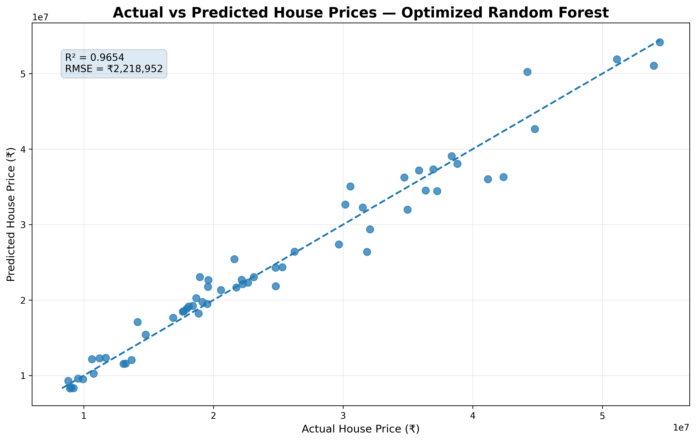

> **End-to-End House Price Prediction using Regression, Ensemble Learning, Hyperparameter Optimization & Model Diagnostics**

---

## 📌 Project Overview

This project develops an end-to-end machine learning workflow for predicting residential property prices.

The project goes beyond a basic regression implementation by combining:

- Data loading and validation
- Data quality checks
- Exploratory Data Analysis (EDA)
- Correlation and relationship analysis
- Categorical feature encoding
- Train-test splitting
- Leakage-safe preprocessing
- Linear Regression implemented from scratch
- Validation against Scikit-learn Linear Regression
- Polynomial Regression
- Decision Tree Regression
- Random Forest Regression
- Random Forest hyperparameter optimization using 5-fold cross-validation
- Permutation Feature Importance
- Actual vs. Predicted analysis
- Residual diagnostics
- Model comparison
- Business interpretation
- Limitations and future scope

The objective is not only to obtain a high prediction score, but also to demonstrate a **complete, reproducible, and interpretable machine-learning workflow**.
## 🎯 Objectives

The major objectives of this project are:

1. Understand the structure and quality of the house-price dataset.
2. Explore relationships between property characteristics and house prices.
3. Identify the most influential variables associated with house prices.
4. Prepare numerical and categorical variables for machine learning.
5. Implement Multiple Linear Regression mathematically from scratch.
6. Validate the custom implementation against Scikit-learn.
7. Compare linear and nonlinear regression approaches.
8. Optimize Random Forest hyperparameters using cross-validation.
9. Evaluate models using MAE, MSE, RMSE, and R².
10. Diagnose the final model using residual analysis.
11. Select the best-performing model based on unseen test data.
12. Translate statistical and machine-learning findings into practical insights.

---

## 📊 Dataset

The project uses a residential property dataset containing **300 observations**.

### Target Variable

**Price**

The model learns patterns between property characteristics and the selling price of the property.

### Numerical Predictors

- `Area`
- `Bedrooms`
- `Bathrooms`
- `Age`

### Categorical Predictors

- `Location`
- `Property_Type`

### Identifier

- `Property_ID`

`Property_ID` is treated as an identifier and excluded from predictive modelling because it does not represent a meaningful property characteristic.

### Dataset Summary

| Category | Details |
|---|---|
| Observations | 300 |
| Target Variable | Price |
| Numerical Features | Area, Bedrooms, Bathrooms, Age |
| Categorical Features | Location, Property Type |
| Identifier | Property_ID |
| Training Data | 240 observations (80%) |
| Testing Data | 60 observations (20%) |

---

## 🛠️ Technology Stack

| Category | Technology |
|---|---|
| Programming Language | Python |
| Data Manipulation | Pandas |
| Numerical Computing | NumPy |
| Visualization | Matplotlib, Seaborn |
| Machine Learning | Scikit-learn |
| Development Environment | Jupyter Notebook / VS Code |
| Output Format | CSV, PNG |
| Documentation | Markdown |

---

## 🔄 Project Workflow

The project follows a structured end-to-end machine learning workflow:

```text
Dataset
   ↓
Data Loading & Validation
   ↓
Data Cleaning & Quality Checks
   ↓
Exploratory Data Analysis
   ↓
Feature Selection
   ↓
Train-Test Split
   ↓
Leakage-Safe Preprocessing
   ↓
Linear Regression From Scratch
   ↓
Scikit-learn Validation
   ↓
Polynomial Regression
   ↓
Decision Tree Regression
   ↓
Random Forest Regression
   ↓
Hyperparameter Optimization
   ↓
Final Model Evaluation
   ↓
Feature Importance
   ↓
Residual Diagnostics
   ↓
Model Comparison
   ↓
Business Insights & Conclusion

## 🔎 Exploratory Data Analysis

The EDA phase was performed to understand the structure of the dataset, identify important relationships, detect potential patterns, and understand the factors associated with house prices.

The analysis focused on:

- Distribution of house prices
- Relationship between Area and Price
- Relationship of Bedrooms and Bathrooms with Price
- Distribution across Location and Property Type
- Relationship between Age and Price
- Correlation between numerical variables
- Area-Price relationships across different locations

### 📊 EDA Visualizations

#### 1. Price Distribution

The price distribution provides an overview of the target variable and helps identify its spread and potential skewness.

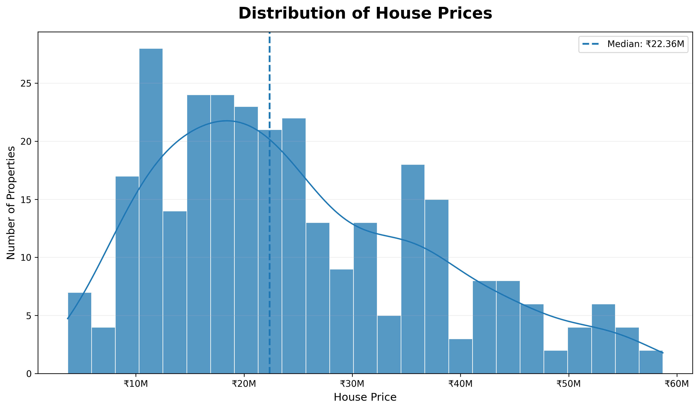

---

#### 2. Area vs Price

This visualization examines the relationship between property area and house price.

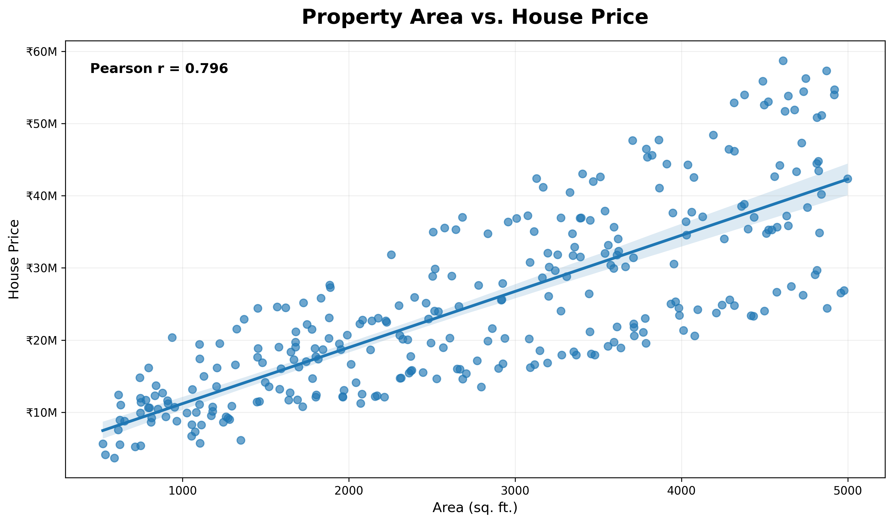

---

#### 3. Bedrooms & Bathrooms vs Price

This visualization explores how the number of bedrooms and bathrooms relates to property prices.

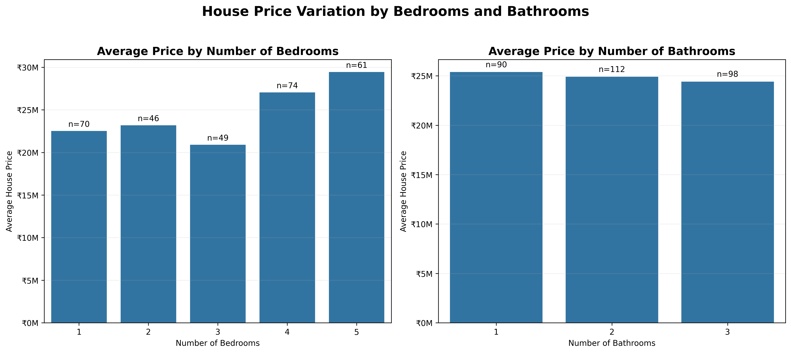

---

#### 4. Location & Property Type Distribution

This visualization compares the distribution of properties across different locations and property types.

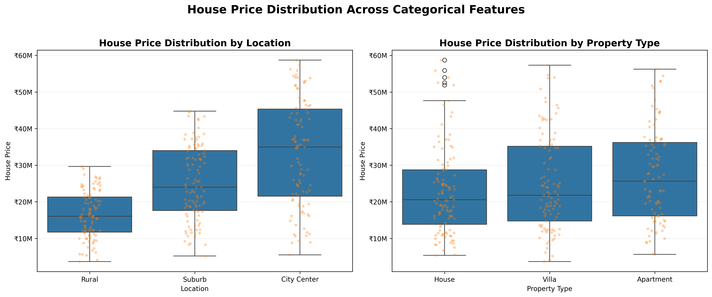

---

#### 5. Age vs Price

This visualization investigates whether property age is associated with house price.

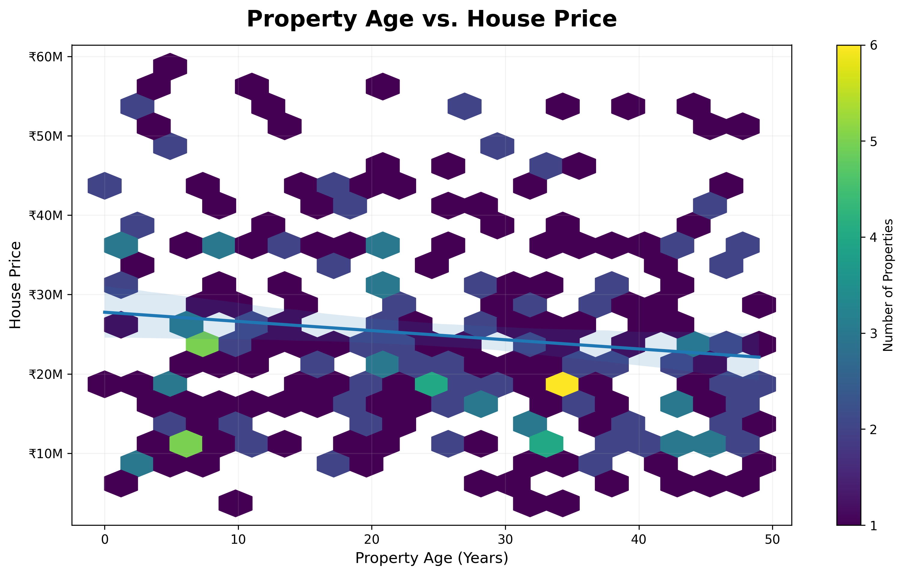

---

#### 6. Correlation Heatmap

The correlation heatmap summarizes the linear relationships between the numerical variables in the dataset.

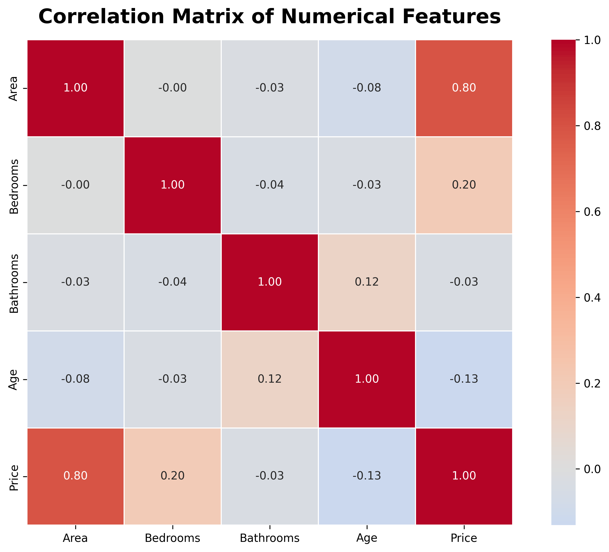

---

#### 7. Area-Price Relationship by Location

This visualization examines whether the relationship between property area and price differs across locations.

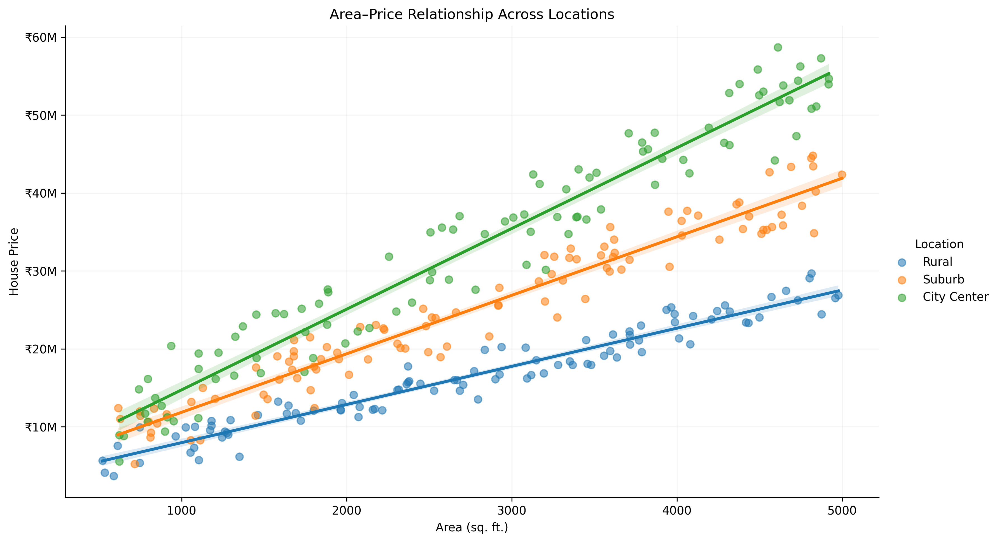

---

### 💡 Key EDA Findings

- **Area** has the strongest numerical relationship with Price, with a Pearson correlation of approximately **0.80**.
- **Location** has a substantial influence on property prices.
- **Bedrooms** show a moderate positive relationship with price.
- **Age** has a weak negative relationship with price.
- **Bathrooms** show very little standalone linear correlation with price.
- The Area-Price relationship remains strong across different locations.

These findings guided the subsequent feature preparation and model development stages.

---

## 🧹 Data Preprocessing & Feature Engineering

The preprocessing stage was designed to prepare the raw dataset for machine learning while maintaining a strict separation between training and testing data.

### 🔹 Preprocessing Steps

1. Separated the target variable `Price` from the predictor variables.
2. Removed `Property_ID` from the modelling features because it is an identifier rather than a predictive property characteristic.
3. Split the dataset into:
   - **80% training data — 240 observations**
   - **20% testing data — 60 observations**
4. Identified numerical and categorical features.
5. Applied one-hot encoding to categorical variables.
6. Used `drop="first"` to establish reference categories and avoid redundant dummy variables.
7. Fitted preprocessing transformations using the training data only.
8. Applied the same learned transformations to the unseen test data.

### 🔹 Numerical Features

The following numerical variables were used:

- `Area`
- `Bedrooms`
- `Bathrooms`
- `Age`

### 🔹 Categorical Features

The following categorical variables were encoded:

- `Location`
- `Property_Type`

### 🔹 Reference Categories

To avoid redundant dummy variables, the first category was used as the reference category:

- **City Center** → reference category for `Location`
- **Apartment** → reference category for `Property_Type`

The resulting encoded categorical variables include:

- `Location_Rural`
- `Location_Suburb`
- `Property_Type_House`
- `Property_Type_Villa`

### 🔹 Final Model Features

After preprocessing, the model uses **8 predictive features**:

```text
Area
Bedrooms
Bathrooms
Age
Location_Rural
Location_Suburb
Property_Type_House
Property_Type_Villa
## 📐 Linear Regression

Linear Regression was used as the baseline predictive model. Two implementations were evaluated:

1. **Linear Regression implemented from scratch**
2. **Scikit-learn Linear Regression**

This provides both mathematical understanding and a practical machine-learning benchmark.

### 6.1 Linear Regression From Scratch

Multiple Linear Regression was implemented manually using the **Ordinary Least Squares (OLS)** approach.

The implementation involved:

- Constructing the design matrix.
- Adding the intercept term.
- Estimating regression coefficients mathematically.
- Using the Moore-Penrose pseudoinverse for numerical stability.
- Generating predictions for the unseen test dataset.
- Evaluating predictions using standard regression metrics.

The mathematical formulation is:

$$
\hat{\beta} = (X^T X)^{-1}X^T y
$$

where:

- $X$ = design matrix
- $y$ = target vector
- $\hat{\beta}$ = estimated regression coefficients

The pseudoinverse formulation was used in implementation to provide greater numerical stability.

### 6.2 Scikit-learn Linear Regression

The same processed training and testing data were then used with Scikit-learn's `LinearRegression` estimator.

This provides a reliable benchmark for validating the custom implementation.

### 6.3 Scratch vs Scikit-learn Validation

The custom implementation was compared against the Scikit-learn implementation using:

- Mean Absolute Error (MAE)
- Mean Squared Error (MSE)
- Root Mean Squared Error (RMSE)
- R² Score

The two implementations produced effectively identical predictions and evaluation results.

This validates that the manually implemented Ordinary Least Squares solution was mathematically consistent with the standard Scikit-learn implementation.

### 📊 Linear Regression Results

The detailed numerical results are available in:

```text
results/linear_regression_scratch_results.csv
results/scratch_vs_sklearn_comparison.csv
results/linear_regression_coefficients.csv
## 🌳 Nonlinear Regression Models

To determine whether nonlinear models could improve upon the Linear Regression baseline, Polynomial Regression and Decision Tree Regression were evaluated.

---

### 7.1 Polynomial Regression

A **degree-2 Polynomial Regression** model was developed to capture potential nonlinear relationships between numerical predictors and house prices.

The polynomial transformation was applied to the numerical features, while categorical variables remained appropriately encoded.

#### Model Configuration

- Polynomial degree = 2
- Numerical features expanded to polynomial terms
- Categorical features retained using one-hot encoding
- Evaluation performed on the unseen test dataset

#### Performance

| Metric | Score |
|---|---:|
| MAE | ₹2,367,902.24 |
| MSE | ₹10,116,153,891,351.46 |
| RMSE | ₹3,180,590.18 |
| R² | 0.9290 |

The Polynomial Regression model achieved an R² of **0.9290**.

Although it was able to capture nonlinear relationships, it did not outperform the Linear Regression baseline.

This demonstrates that adding polynomial complexity does not necessarily improve generalization performance.

The detailed results are available in:

```text
results/polynomial_regression_results.csv
## 🌲 Random Forest Regression

Random Forest Regression was introduced to capture nonlinear relationships and feature interactions while reducing the limitations of a single Decision Tree.

Random Forest is an ensemble learning technique that combines predictions from multiple decision trees to produce a more robust prediction.

---

### 8.1 Initial Random Forest Model

An initial Random Forest model was trained using a controlled configuration to establish a baseline for ensemble performance.

#### Model Configuration

| Parameter | Value |
|---|---:|
| Number of Trees | 300 |
| Maximum Depth | 8 |
| Minimum Samples Split | 5 |
| Minimum Samples Leaf | 2 |
| Max Features | `sqrt` |
| Random State | 42 |

### Initial Model Performance

| Metric | Score |
|---|---:|
| MAE | ₹3,684,313.62 |
| MSE | ₹23,182,820,406,988.07 |
| RMSE | ₹4,814,854.14 |
| R² | 0.8372 |

The initial Random Forest achieved an **R² of 0.8372**, which was substantially lower than the Linear Regression baseline.

This result demonstrates that ensemble models do not automatically outperform simpler models. Model configuration and hyperparameter selection can have a significant impact on generalization performance.

---

### 8.2 Why Optimization Was Required

The initial Random Forest showed considerable room for improvement.

Instead of manually selecting a different configuration, a systematic hyperparameter optimization process was used.

The optimization process searched across multiple Random Forest parameters using cross-validation while keeping the test dataset completely isolated.

This approach allowed the model configuration to be selected based on training-data cross-validation rather than test-set performance.

---

### 📊 Random Forest Results

The detailed initial Random Forest results are available in:

```text
results/random_forest_results.csv
## ⚙️ Random Forest Hyperparameter Optimization

The initial Random Forest model showed that model configuration had a significant impact on predictive performance.

To systematically improve the model, **Randomized Search with 5-fold Cross-Validation** was performed.

### 9.1 Optimization Strategy

The optimization process searched across multiple Random Forest hyperparameters, including:

- Number of estimators
- Maximum tree depth
- Minimum samples required for a split
- Minimum samples required at a leaf
- Number of features considered at each split

### Cross-Validation Setup

| Parameter | Value |
|---|---:|
| Search Method | Randomized Search |
| Candidate Configurations | 20 |
| Cross-Validation | 5-Fold |
| Total Model Fits | 100 |
| Optimization Metric | RMSE |
| Random State | 42 |

The **test dataset was not used during hyperparameter optimization**.

This prevents test-set information from influencing model selection and provides a more reliable estimate of final generalization performance.

---

### 9.2 Best Hyperparameter Configuration

The optimization process identified the following configuration as the best-performing Random Forest setup:

| Hyperparameter | Optimal Value |
|---|---:|
| Number of Trees (`n_estimators`) | **300** |
| Maximum Depth (`max_depth`) | **12** |
| Minimum Samples Split (`min_samples_split`) | **2** |
| Minimum Samples Leaf (`min_samples_leaf`) | **2** |
| Max Features (`max_features`) | **1.0** |
| Random State | **42** |

### Best Cross-Validated Performance

The best configuration achieved a cross-validated RMSE of approximately:

**₹2,188,687.95**

This represented a substantial improvement over the initial Random Forest configuration.

---

### 9.3 Optimization Impact

The optimization process demonstrated the importance of hyperparameter selection.

| Model | R² | RMSE |
|---|---:|---:|
| Initial Random Forest | 0.8372 | ₹4.81M |
| **Optimized Random Forest** | **0.9654** | **₹2.22M** |

The optimized model achieved a significantly higher R² and substantially lower RMSE on the unseen test dataset.

This confirms that systematic hyperparameter optimization can have a major impact on ensemble model performance.

---

### 📊 Optimization Results

The detailed optimized Random Forest results are available in:

```text
results/optimized_random_forest_results.csv
## 🏆 Final Model Performance

After hyperparameter optimization, the **Optimized Random Forest Regression** model was selected as the final predictive model.

The final evaluation was performed on the **unseen 20% test dataset containing 60 observations**.

### 10.1 Final Test Performance

| Metric | Optimized Random Forest |
|---|---:|
| **MAE** | **₹1,611,259.09** |
| **MSE** | **₹4,923,749,816,934.83** |
| **RMSE** | **₹2,218,952.41** |
| **R²** | **0.9654** |

### 10.2 Metric Interpretation

#### R² — 0.9654

The final model achieved an R² score of **0.9654**, indicating that approximately **96.54% of the variation in house prices is explained by the model on the held-out test dataset**.

A higher R² indicates stronger predictive performance.

#### RMSE — ₹2.22 Million

The Root Mean Squared Error was approximately **₹2.22 million**.

RMSE measures prediction error in the same unit as the target variable, with larger errors receiving greater weight.

A lower RMSE indicates better predictive performance.

#### MAE — ₹1.61 Million

The Mean Absolute Error was approximately **₹1.61 million**.

This represents the average absolute difference between the actual and predicted house prices on the test dataset.

A lower MAE indicates better predictive performance.

#### MSE — ₹4.92 Trillion

The Mean Squared Error was approximately:

**₹4.92 × 10¹²**

Because the errors are squared, MSE places greater emphasis on larger prediction errors.

---

### 10.3 Final Model Selection

The Optimized Random Forest was selected because it achieved:

- **Highest R²:** 0.9654
- **Lowest RMSE:** ₹2.22M
- **Strong MAE:** ₹1.61M
- Strong performance on previously unseen test data

The model therefore provided the best overall predictive performance among the evaluated approaches.

> **Important:** The reported metrics describe predictive performance on this particular dataset and test split. They should not be interpreted as a guarantee of the same performance on a different housing market or future dataset.

---
## 📊 Model Performance Comparison

To determine the best predictive approach, all evaluated regression models were compared using **R²** and **RMSE** on the same unseen test dataset.

### 11.1 R² Comparison

R² measures the proportion of variation in house prices explained by the model.

**Higher R² indicates better performance.**

| Model | R² |
|---|---:|
| **Optimized Random Forest** | **0.9654** |
| Linear Regression | 0.9406 |
| Polynomial Regression | 0.9290 |
| Decision Tree | 0.9238 |
| Initial Random Forest | 0.8372 |

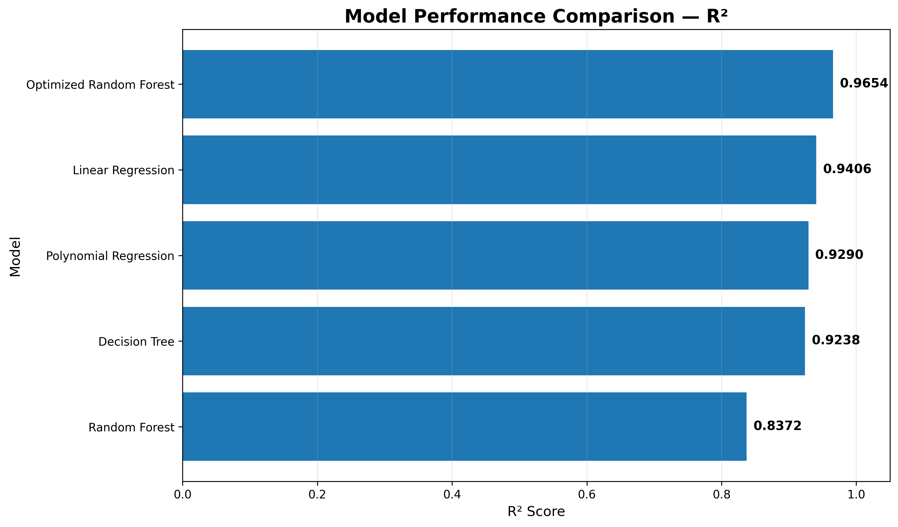

### 11.2 RMSE Comparison

RMSE measures the typical magnitude of prediction error in the same monetary unit as the target variable.

**Lower RMSE indicates better performance.**

| Model | RMSE |
|---|---:|
| **Optimized Random Forest** | **₹2.22M** |
| Linear Regression | ₹2.91M |
| Polynomial Regression | ₹3.18M |
| Decision Tree | ₹3.29M |
| Initial Random Forest | ₹4.81M |

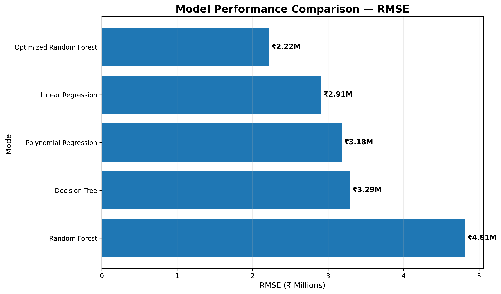

### 11.3 Comparison Summary

The model comparison produces a consistent result:

- **Optimized Random Forest** achieved the highest R².
- **Optimized Random Forest** achieved the lowest RMSE.
- Linear Regression provided a strong baseline.
- Polynomial Regression did not improve upon Linear Regression.
- Decision Tree Regression performed slightly below the linear baseline.
- The initial Random Forest configuration performed poorly before optimization.
- Hyperparameter optimization substantially improved Random Forest performance.

### 🏆 Best Performing Model

Based on both evaluation metrics, the **Optimized Random Forest Regression** model was selected as the final model.

**R² = 0.9654**  
**RMSE = ₹2.22M**

The agreement between the two metrics provides stronger evidence for selecting the optimized Random Forest rather than relying on a single performance measure.

---
## 🎯 Model Diagnostics

Model performance metrics alone do not provide a complete picture of predictive quality.

Therefore, the final Optimized Random Forest model was further evaluated using:

- Actual vs Predicted analysis
- Residual distribution
- Residuals vs Predicted values

These diagnostics help identify systematic prediction errors, unusual observations, and potential patterns that may not be visible from R² or RMSE alone.

---

### 12.1 Actual vs Predicted Prices

The Actual vs Predicted visualization compares the observed house prices with the prices predicted by the final model.


#### Interpretation

The predictions are generally concentrated around the ideal diagonal relationship between actual and predicted values.

This indicates strong agreement between observed and predicted house prices.

A small number of observations show larger deviations from the diagonal, indicating relatively larger prediction errors for those properties.

---

### 12.2 Residual Distribution

A residual represents the difference between the actual and predicted price:

$$
Residual = Actual\ Price - Predicted\ Price
$$

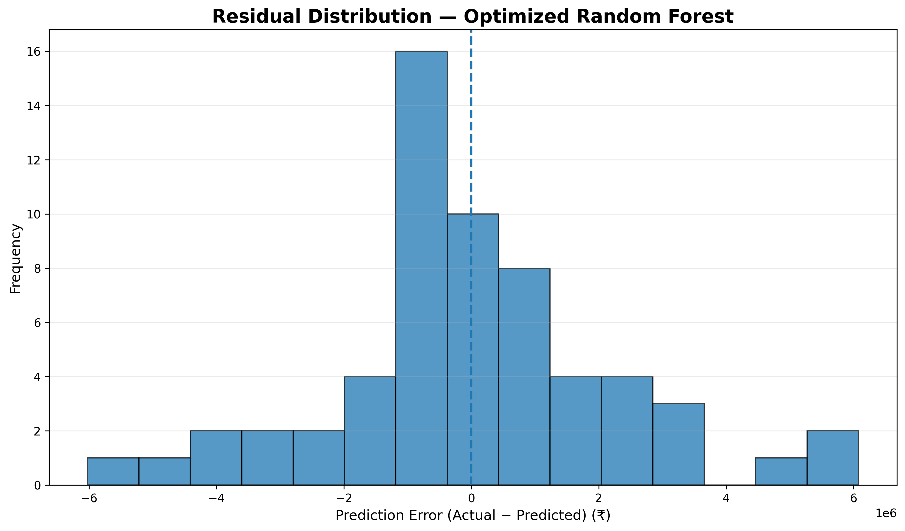

#### Interpretation

The residuals are generally distributed around zero, indicating that the model does not exhibit a strong overall directional bias.

However, a small number of observations produce relatively larger residuals, which contribute to the overall RMSE.

---

### 12.3 Residuals vs Predicted Price

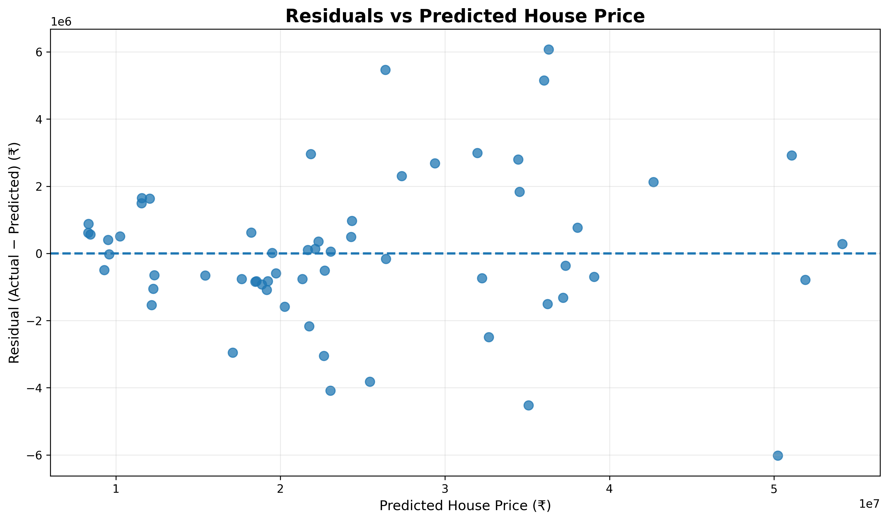

#### Interpretation

The residuals occur on both sides of zero without a pronounced systematic curve.

This suggests that the final model does not show a strong nonlinear pattern in its remaining prediction errors.

Some increase in error spread can be observed at higher predicted prices, suggesting that expensive properties may be somewhat harder to predict accurately.

---

### 12.4 Diagnostic Summary

The diagnostic analysis indicates that:

- Predictions generally follow the actual price pattern closely.
- Residuals are centered approximately around zero.
- No major systematic residual pattern is evident.
- A small number of observations contribute larger prediction errors.
- Higher-priced properties show somewhat greater prediction variability.

Overall, the diagnostic plots support the strong test-set performance indicated by the R² and RMSE metrics.

---
## 🧠 Model Interpretation

Model evaluation tells us how accurately the model predicts prices, while model interpretation helps explain which variables contribute most to those predictions.

Two complementary approaches were used:

1. Linear Regression coefficient analysis
2. Permutation Feature Importance

---

### 13.1 Linear Regression Coefficients

The Linear Regression coefficients provide directional information about the relationship between each feature and predicted house price, while holding the other model variables constant.

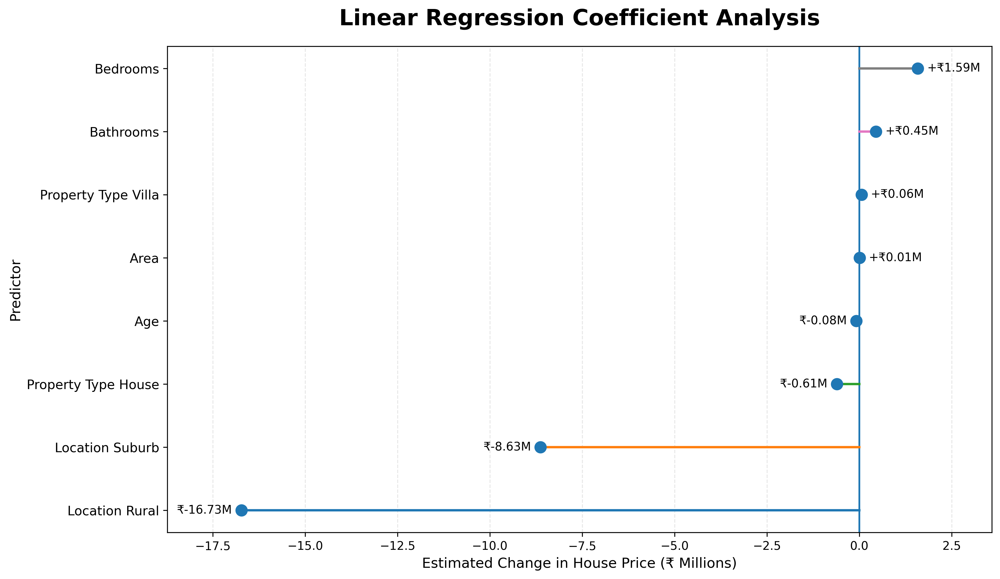

#### Interpretation

The coefficient analysis shows that:

- Numerical variables such as **Bedrooms** and **Bathrooms** have positive coefficients in the fitted linear model.
- The encoded **Location** variables have substantial coefficient effects relative to the selected reference category.
- Categorical coefficients must be interpreted relative to their reference categories.
- Coefficient magnitude should not be treated as a direct feature-importance ranking because the predictors have different units and scales.

The complete coefficient output is available in:

```text
results/linear_regression_coefficients.csv
## 💡 Key Findings & Business Insights

The analysis combines the findings from EDA, statistical relationships, model performance, feature importance, and diagnostic evaluation.

### 14.1 Key Findings

#### 1. Area is the strongest numerical predictor

Area has a strong positive relationship with house price, with a Pearson correlation of approximately **0.80**.

This indicates that larger properties generally command higher prices within this dataset.

#### 2. Location has substantial pricing influence

Properties in different locations show meaningful differences in their average price levels.

Location also ranks highly in the final model's permutation importance, demonstrating its predictive value.

#### 3. Bedrooms have a moderate relationship with price

The number of bedrooms shows a positive relationship with house price.

However, its predictive contribution is considerably lower than that of Area and Location.

#### 4. Age has a weak negative relationship with price

Older properties tend to have somewhat lower prices in this dataset.

However, the relationship is relatively weak, and Age is not among the dominant predictive features.

#### 5. Bathrooms have limited standalone linear association

Bathrooms show very little linear correlation with price.

This does not necessarily mean that bathrooms are irrelevant. Their information may overlap with other property characteristics such as Area and Bedrooms.

#### 6. Model complexity does not automatically improve performance

Polynomial Regression and Decision Tree Regression did not outperform the Linear Regression baseline.

This demonstrates that increasing model complexity alone does not guarantee better generalization.

#### 7. Hyperparameter optimization significantly improved Random Forest

The initial Random Forest achieved:

**R² = 0.8372**

After hyperparameter optimization:

**R² = 0.9654**

This demonstrates the substantial impact that appropriate model configuration can have on ensemble performance.

#### 8. Optimized Random Forest was the strongest model

The Optimized Random Forest achieved:

- Highest R²
- Lowest RMSE
- Strong MAE performance

Therefore, it was selected as the final predictive model for this dataset.

---

### 14.2 Business Insights

The findings provide several practical insights for property pricing and decision-making.

#### 🏠 Property Area

Property area should be considered one of the primary factors when estimating residential property prices because it shows the strongest numerical relationship with price.

#### 📍 Location

Location should be explicitly considered in valuation models because properties in different locations can have substantially different price levels.

#### 🛏️ Property Characteristics

Bedrooms, bathrooms, age, and property type can provide additional information, but their predictive contribution should be evaluated alongside stronger variables rather than in isolation.

#### 🤖 Data-Driven Valuation

Machine-learning models can support property-price estimation by combining multiple characteristics simultaneously.

The Optimized Random Forest provides the strongest predictive performance among the models evaluated in this project.

#### ⚠️ Prediction vs Professional Valuation

Model predictions should be treated as analytical estimates rather than exact professional property valuations.

Real-world property prices may also depend on factors that are not included in the dataset.

---

### 14.3 Overall Insight

The overall analysis indicates that **property size and location are the most important sources of predictive information** in this dataset.

The combination of exploratory analysis, model comparison, hyperparameter optimization, and feature-importance analysis provides a consistent basis for selecting the Optimized Random Forest as the final model.

---
## ⚠️ Limitations

Although the final model achieved strong performance, several limitations should be considered when interpreting the results.

### 15.1 Dataset Size

The dataset contains only **300 observations**.

A relatively small dataset can limit the ability of a model to generalize to a much larger and more diverse housing market.

### 15.2 Limited Feature Set

The available variables do not capture every factor that can influence property prices.

Important real-world factors such as:

- Distance to schools
- Distance to hospitals
- Public transportation accessibility
- Nearby commercial facilities
- Neighborhood quality
- Parking availability
- Floor number
- Property condition
- Local infrastructure
- Market demand

are not included.

### 15.3 Geographic Generalization

The dataset may represent a specific housing environment.

Therefore, the model should not automatically be assumed to perform equally well across different cities, regions, or housing markets.

### 15.4 Temporal Factors

House prices can change over time due to:

- Inflation
- Interest rates
- Economic conditions
- Housing demand
- Government policies
- Local development

These temporal factors are not represented in the current dataset.

### 15.5 Test Set Size

The final evaluation is based on a held-out test set of **60 observations**.

While this provides an independent evaluation, a larger dataset would allow more robust validation.

### 15.6 Prediction Errors

The diagnostic analysis shows that some higher-priced properties have relatively larger prediction errors.

Therefore, the model should be considered a prediction-support tool rather than an exact valuation system.

---

## 🚀 Future Scope

The project can be extended in several directions.

### 15.7 Larger and More Diverse Dataset

Collecting more property records from multiple locations and time periods could improve model robustness and generalization.

### 15.8 Additional Features

Future versions could include:

- Geographic coordinates
- Distance to schools
- Distance to hospitals
- Distance to public transport
- Nearby amenities
- Parking availability
- Floor number
- Property condition
- Furnishing status
- Neighborhood characteristics

### 15.9 Advanced Machine Learning Models

Additional algorithms could be evaluated, including:

- Gradient Boosting
- XGBoost
- LightGBM
- Extra Trees Regression
- Support Vector Regression
- Stacking and ensemble methods

### 15.10 Advanced Hyperparameter Optimization

Future experiments could compare:

- Grid Search
- Randomized Search
- Bayesian Optimization
- Optuna-based optimization

This could provide a more extensive search of the model's hyperparameter space.

### 15.11 More Robust Validation

Future versions could use:

- Repeated K-Fold Cross-Validation
- Nested Cross-Validation
- Bootstrap validation
- Multiple train-test splits

These approaches could provide more robust estimates of model performance.

### 15.12 Explainable AI

Interpretability could be extended using techniques such as:

- SHAP
- Partial Dependence Plots
- Individual Conditional Expectation (ICE)
- Permutation-based analysis

These methods could provide more detailed explanations of individual predictions.

### 15.13 Model Deployment

The final model could be deployed as:

- A Streamlit web application
- A Flask/FastAPI API
- A desktop application
- A cloud-based prediction service

Users could enter property characteristics and receive an estimated house price in real time.

### 15.14 Model Monitoring

If deployed in a real-world environment, the model could be monitored for:

- Prediction drift
- Data drift
- Changes in feature distributions
- Changes in model accuracy
- Housing-market changes

This would help maintain model reliability over time.

---
## 📁 Project Structure

The project is organized into separate files and directories for analysis, results, visualizations, and documentation.

```text
HOUSE-PRICE-PREDICTION/
│
├── README.md
├── requirements.txt
├── house_price_prediction.ipynb
├── house_prices.csv
│
├── results/
│   ├── preprocessing_summary.csv
│   ├── numerical_correlation_matrix.csv
│   ├── age_price_correlation.csv
│   ├── area_price_correlation.csv
│   ├── area_price_correlation_by_location.csv
│   ├── bedrooms_bathrooms_price_analysis.csv
│   ├── location_property_type_price_analysis.csv
│   ├── linear_regression_scratch_results.csv
│   ├── scratch_vs_sklearn_comparison.csv
│   ├── linear_regression_coefficients.csv
│   ├── permutation_feature_importance.csv
│   ├── polynomial_regression_results.csv
│   ├── decision_tree_results.csv
│   ├── random_forest_results.csv
│   └── optimized_random_forest_results.csv
│
└── visualizations/
    ├── 01_price_distribution.png
    ├── 02_area_vs_price.png
    ├── 03_bedrooms_bathrooms_vs_price.png
    ├── 04_location_property_type_distribution.png
    ├── 05_age_vs_price.png
    ├── 06_correlation_heatmap.png
    ├── 07_area_price_by_location.png
    ├── actual_vs_predicted.png
    ├── linear_regression_coefficients.png
    ├── permutation_feature_importance.png
    ├── residual_distribution.png
    ├── residuals_vs_predicted.png
    ├── model_r2_comparison.png
    └── model_rmse_comparison.png
## ▶️ Installation & Setup

### 17.1 Clone the Repository

Clone the repository using Git:

```bash
git clone <YOUR-GITHUB-REPOSITORY-URL>
cd House-Price-Prediction
17.2 Create a Virtual Environment

Creating a virtual environment is recommended to keep project dependencies isolated.
python -m venv venv
venv\Scripts\activate
17.3 Install Dependencies

Install all required Python packages using:

pip install -r requirements.txt

The project requires:

NumPy
Pandas
Matplotlib
Seaborn
Scikit-learn
Jupyter
▶️ Running the Project
Option 1 — Jupyter Notebook

Launch Jupyter Notebook:

jupyter notebook

Open:

house_price_prediction.ipynb

Run the notebook sequentially from the first cell to the final cell.
🔄 Execution Flow

When the notebook is executed, it performs the following operations:

Load Dataset
     ↓
Validate Dataset
     ↓
Data Quality Checks
     ↓
Exploratory Data Analysis
     ↓
Feature Preparation
     ↓
Train-Test Split
     ↓
Preprocessing
     ↓
Linear Regression From Scratch
     ↓
Scikit-learn Linear Regression
     ↓
Polynomial Regression
     ↓
Decision Tree Regression
     ↓
Initial Random Forest
     ↓
Random Forest Hyperparameter Optimization
     ↓
Final Model Evaluation
     ↓
Feature Importance
     ↓
Model Diagnostics
     ↓
Model Comparison
     ↓
Key Findings & Conclusion
💾 Generated Outputs

After execution, the project produces:

CSV Results

Saved inside:

results/
PNG Visualizations

Saved inside:

visualizations/

These outputs can be reused independently in reports, presentations, or further analysis.
## 🔁 Reproducibility

Several practices were followed to make the analysis consistent, reproducible, and reliable.

### Reproducibility Practices

- Fixed `random_state=42` where applicable.
- Used a consistent train-test split.
- Kept the test dataset completely unseen during model training.
- Kept the test dataset isolated during hyperparameter optimization.
- Fitted preprocessing transformations using training data only.
- Applied the same transformations to the unseen test data.
- Used the same evaluation metrics across all regression models.
- Validated the custom Linear Regression implementation against Scikit-learn.
- Used 5-fold cross-validation during Random Forest optimization.
- Saved numerical outputs as CSV files.
- Saved analytical and diagnostic visualizations as PNG files.
- Documented the complete workflow inside the Jupyter Notebook.

These practices help ensure that the reported model performance can be reproduced under the same environment and dataset conditions.

---

## 🧪 Evaluation Metrics

Multiple regression metrics were used to evaluate the predictive performance of the models.

### Mean Absolute Error — MAE

MAE measures the average absolute difference between actual and predicted values.

$$
MAE = \frac{1}{n}\sum_{i=1}^{n}|y_i-\hat{y}_i|
$$

A **lower MAE** indicates better predictive performance.

---

### Mean Squared Error — MSE

MSE measures the average squared difference between actual and predicted values.

$$
MSE = \frac{1}{n}\sum_{i=1}^{n}(y_i-\hat{y}_i)^2
$$

Because the errors are squared, larger prediction errors receive greater weight.

A **lower MSE** indicates better performance.

---

### Root Mean Squared Error — RMSE

RMSE is the square root of MSE:

$$
RMSE = \sqrt{MSE}
$$

RMSE is expressed in the same unit as the target variable, making it easier to interpret in terms of house-price prediction error.

A **lower RMSE** indicates better predictive performance.

---

### R² Score

R² measures the proportion of variance in the target variable that is explained by the model.

$$
R^2 = 1-\frac{\sum(y_i-\hat{y}_i)^2}{\sum(y_i-\bar{y})^2}
$$

A value closer to **1.0** indicates stronger predictive performance.

The final Optimized Random Forest achieved:

**R² = 0.9654**

which means that approximately **96.54% of the variation in house prices in the held-out test dataset is explained by the model**.

---

### 📊 Metric Selection

Using multiple evaluation metrics provides a more complete assessment than relying on a single score.

| Metric | Preferred Direction | Purpose |
|---|---|---|
| MAE | Lower | Average absolute prediction error |
| MSE | Lower | Penalizes larger errors |
| RMSE | Lower | Error magnitude in target units |
| R² | Higher | Proportion of explained variance |

The Optimized Random Forest performed best across the key evaluation criteria.

---
## 🏁 Final Conclusion

This project demonstrates a complete end-to-end machine learning workflow for residential house-price prediction.

The analysis progressed from data validation and exploratory analysis through feature preparation, model development, hyperparameter optimization, model diagnostics, and final interpretation.

Several regression approaches were evaluated, including:

- Linear Regression From Scratch
- Scikit-learn Linear Regression
- Polynomial Regression
- Decision Tree Regression
- Initial Random Forest Regression
- Optimized Random Forest Regression

The comparison demonstrated that model complexity alone does not guarantee better predictive performance. While Linear Regression provided a strong baseline, systematic Random Forest hyperparameter optimization produced a substantial improvement in predictive performance.

The final Optimized Random Forest achieved the strongest performance on the unseen test dataset.

### Key Conclusions

- **Area** is the strongest numerical predictor of house price.
- **Location** provides substantial predictive information.
- Linear Regression provides a strong and interpretable baseline.
- Polynomial Regression did not improve upon the linear baseline.
- The initial Random Forest configuration performed poorly before optimization.
- Hyperparameter optimization substantially improved Random Forest performance.
- Residual diagnostics showed generally well-distributed prediction errors with some larger errors among higher-priced properties.
- The Optimized Random Forest achieved the best overall predictive performance among the evaluated models.

---

## 🏆 Final Model

### Optimized Random Forest Regression

| Metric | Final Score |
|---|---:|
| **R²** | **0.9654** |
| **RMSE** | **₹2.22M** |
| **MAE** | **₹1.61M** |
| **MSE** | **₹4.92T** |

The final model explains approximately **96.54% of the variation in house prices within the held-out test dataset**.

The model is therefore selected as the final predictive solution for this dataset.

> **Disclaimer:** The model is intended for educational and analytical purposes. Predictions should be treated as estimates and should not be considered professional property valuations.

---

## 📌 Project Highlights

| Area | Achievement |
|---|---|
| Dataset | 300 property records |
| Train-Test Split | 80:20 |
| Models Evaluated | 6 approaches |
| Hyperparameter Optimization | Randomized Search + 5-Fold CV |
| Best Model | Optimized Random Forest |
| Best R² | **0.9654** |
| Best RMSE | **₹2.22M** |
| Feature Importance | Permutation Importance |
| Model Diagnostics | Actual vs Predicted + Residual Analysis |
| Output Artifacts | CSV + PNG |
| Documentation | Complete README + Jupyter Notebook |

---

## 👤 Author

**Vaibhav Shukla**

**BCA Graduate | Data Analytics & Machine Learning**

---

⭐ **Thank you for exploring this project!**

Feel free to explore the Jupyter Notebook, results, and visualizations to understand the complete analysis and modelling workflow.
